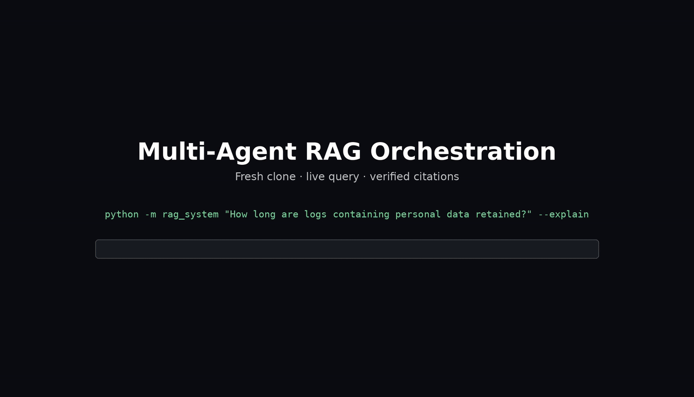

# Multi-Agent RAG Orchestration System

[](https://github.com/kirilogk7/multi-agent-rag-orchestrator/actions/workflows/ci.yml)
[](https://www.python.org/downloads/)
[](LICENSE)

This repository contains both deliverables:

| | Deliverable | Where |
|---|---|---|
| **1** | Multi-agent RAG orchestration system | [`rag_system/`](rag_system/) · [`notebooks/demo.ipynb`](notebooks/demo.ipynb) · [`docs/architecture.md`](docs/architecture.md) |
| **2** | Systems design: The Self-Service Paradox | [`systems_design/self_service_paradox.md`](systems_design/self_service_paradox.md) |

---

## Task 1 — Multi-agent RAG orchestration

A simulated multi-agent RAG system over three mock knowledge domains
(**technical**, **business**, **compliance**). A query classifier routes each
question to the domains that own parts of the answer, domain agents retrieve
independently and share what they discover, contradictions between sources are
detected and adjudicated, and a single cited answer is synthesised.

**It runs fully offline.** No API key, no model download, no network access — the
default embedding backend is TF-IDF projected through a truncated SVD, computed
locally. The demo notebook executes end to end on a clean checkout in a few
seconds, and the 51-test suite in a few more.

### Demo



33-second walkthrough of one `--explain` call against a fresh clone: multi-label
routing with confidence scores, query decomposition, the synthesized answer,
the detected contradiction and how it was resolved, citations, the inter-agent
message transcript, and the citation audit — all produced by a single real
invocation, annotated after the fact for clarity.

---

## Quickstart

```bash
git clone https://github.com/kirilogk7/multi-agent-rag-orchestrator.git
cd multi-agent-rag-orchestrator
pip install -r requirements.txt

python -m pytest tests/ -q                 # 51 tests, 2-10s
python -m rag_system --demo                # the three assignment scenarios
python -m rag_system "How long are logs containing personal data retained?" --explain
jupyter lab notebooks/demo.ipynb           # the full walkthrough
```

`--explain` prints the execution plan, the inter-agent message transcript, and
the citation audit. It is the fastest way to see that the coordination is real
rather than decorative.

**You do not need to run the notebook.** It is committed with executed outputs, so
it renders in full on GitHub, charts included — and CI executes it end to end on
every push, so that it runs is verified by the build rather than asserted here.

To execute it anyway without a browser:

```bash
jupyter nbconvert --to notebook --execute notebooks/demo.ipynb --output /tmp/check.ipynb
```

If you are in a Docker container or on a remote host, `jupyter lab` needs two extra
flags (it refuses to start as root, and binds to localhost by default):

```bash
jupyter lab notebooks/demo.ipynb --allow-root --ip=0.0.0.0 --no-browser
# then from your own machine:  ssh -L 8888:localhost:8888 <user>@<host>
```

```python
from rag_system import build_default_orchestrator

orchestrator = build_default_orchestrator()
answer = orchestrator.answer(
    "What's the process for deploying a new microservice "
    "and what compliance checks are needed?"
)
print(answer.text)
print(orchestrator.verify(answer))          # re-read every citation's source span
print(orchestrator.explain(answer.trace_id))
```

---

## Architecture at a glance

```
                                 user query
                                      v
      +---------------------------------------------------------------+
      |                        RAGOrchestrator                        |
      | plan -> phase 1 -> phase 2 -> resolve -> synthesise -> record |
      +---------------------------------------------------------------+
            |                |                |                 |
            v                v                v                 v
    +---------------+ +------------+ +----------------+ +---------------+
    |QueryClassifier| | MessageBus | |ConflictResolver| |MetricsRegistry|
    |    routing    | |+ Blackboard| |    numeric     | +---------------+
    |    intent     | |typed msgs, | |    polarity    |
    |  complexity   | |transcript, | |  supersession  |
    |   decompose   | |shared facts| +----------------+
    | retr. policy  | +------------+
    +---------------+
                                              |
                                              v
                                    +---------------------+
                                    |     Synthesizer     |
                                    |extractive, or Claude|
                                    +---------------------+
                                               |
                                               v
                                         Answer
                                         - cited text
                                         - conflicts
                                         - confidence
                                         - timings
```

The message bus above feeds three domain agents, each with its own namespaced
retriever:

```
                        +--------------------+
                        |     MessageBus     |
                        |(from diagram above)|
                        +--------------------+
                |------------------|------------------|
                v                  v                  v
        +---------------+  +--------------+  +----------------+
        |Technical Agent|  |Business Agent|  |Compliance Agent|
        +---------------+  +--------------+  +----------------+
                |                  |                  |
                |                  |                  |
                v                  v                  v
        +-----------+      +-----------+     +-----------+
        |VectorStore|      |VectorStore|     |VectorStore|
        | technical |      | business  |     |compliance |
        |dense+BM25 |      |dense+BM25 |     |dense+BM25 |
        +-----------+      +-----------+     +-----------+

        +-----------------KnowledgeBase------------------+
                 (versioned, incrementally ingestable)
```

**Execution is two-phase, not a flat fan-out.** Phase 1 runs the primary domain
alone, searching the user's own words; it publishes what it discovers to a shared
blackboard. Phase 2 fans out the supporting domains concurrently, each reading
phase-1 context and specialising its own retrieval before searching.

The cost is one extra round trip. The benefit is that agents actually inform each
other: on the deployment question, phase 1 establishes that the deployment targets
production, and the compliance agent's relevance on the governing change-control
policy rises 23% as a result. A flat fan-out cannot do this, because agents that
start simultaneously have nothing to learn from each other — which reduces
"multi-agent" to several independent searches sharing an output format.

Full design rationale, sequence diagrams and trade-off tables:
**[`docs/architecture.md`](docs/architecture.md)**.

---

## Where each requirement is implemented

| Requirement | Implementation | Demonstrated by |
|---|---|---|
| Query Classifier Agent | [`query_classifier.py`](rag_system/query_classifier.py) · `QueryClassifier.classify` | notebook §2 · `test_assignment_scenario_routes_to_expected_domains` |
| Domain-Specific RAG Agents (×3) | [`domain_agents.py`](rag_system/domain_agents.py) · `DomainAgent` | notebook §1, §5 · `test_namespaces_are_isolated` |
| Orchestrator Agent | [`orchestrator.py`](rag_system/orchestrator.py) · `RAGOrchestrator.answer` | notebook §4 |
| Vector Store Manager | [`vector_store.py`](rag_system/vector_store.py) · `VectorStore`, `KnowledgeBase` | notebook §1 · `test_hybrid_retrieval_beats_dense_only_on_rare_tokens` |
| Agent Communication Protocol | [`protocol.py`](rag_system/protocol.py) · `MessageBus`, `Blackboard` | notebook §5 · `test_context_is_shared_between_agents` |
| Query Decomposition | `QueryClassifier.decompose`, `anchor_clause` | notebook §3 · `test_clause_anchoring_restores_a_stranded_subject` |
| Dynamic Retrieval Strategy | `RetrievalPolicy.for_sub_query` | notebook §3 · `test_retrieval_params_respond_to_complexity` |
| Result Synthesis | [`synthesis.py`](rag_system/synthesis.py) · `ExtractiveSynthesizer`, `ClaudeSynthesizer` | notebook §4, §12 |
| Basic Learning Mechanism | `RAGOrchestrator.apply_feedback`, `replay_feedback` | notebook §9 · `test_feedback_moves_routing_weights` |
| Conflict Resolution | `ConflictResolver` (3 detectors + weighted adjudication) | notebook §6 · `test_numeric_conflict_prefers_policy_over_runbook` |
| Citation Tracking | `Citation`, `verify_citations` | notebook §7 · `test_citation_verification_catches_a_corrupted_span` |
| Knowledge Updates | `KnowledgeBase.ingest`, `RAGOrchestrator.ingest` | notebook §8 · `test_knowledge_update_changes_the_answer` |
| Performance Monitoring | [`monitoring.py`](rag_system/monitoring.py) · `MetricsRegistry` | notebook §10 · `test_metrics_capture_per_stage_and_per_agent_detail` |
| Error handling / edge cases | isolation boundaries throughout | notebook §11 · `test_failing_agent_degrades_rather_than_aborts` |

---

## Design decisions

These are the choices that shaped the result, with the reasoning and the costs.

**1. Local embeddings behind a pluggable interface.** `EmbeddingBackend` is two
methods. The default `TfidfSvdBackend` is classical latent semantic analysis —
TF-IDF through a truncated SVD, so the representation is genuinely
distributional. `SentenceTransformerBackend` implements the same interface for
real embeddings. *Why:* the assignment asks for a simulated system whose notebook
runs end to end; a 400 MB download is a worse answer to that brief than 200 lines
of linear algebra. *Cost:* weaker semantics than a transformer. A reviewer can
swap backends in one line.

**2. Hybrid retrieval, with ranking and confidence kept separate.** Dense cosine
handles paraphrase; BM25 handles the exact tokens this corpus turns on (`p99`,
`SEV1`, `/healthz`, `DPIA`, `30 days`). They are fused with reciprocal rank
fusion because their scores are on incomparable scales. But RRF scores cluster
around `1/k` and are useless for thresholding, so every result *also* carries an
absolute calibrated `relevance` in `[0,1]`. That is the number abstention
thresholds against — which is what lets the system return nothing instead of the
least-bad match.

**3. Generic conflict detectors, gated on topical relatedness.** Three detectors
(numeric, polarity, supersession); none knows anything about this corpus.
Hard-coding "the retention conflict" would demonstrate nothing. Both gates in the
numeric detector exist because the ungated version produced real false positives:
"application logs are retained for 90 days" was reported as contradicting
"customer transaction records are retained for seven years" — same unit family,
shared anchor `retained`, different data categories, no actual disagreement.
Likewise conflicts are deduplicated per `(document pair, dispute)`, because a v2
procedure restates most of v1 and flagging every claim pair turned one real
disagreement into 18 near-identical findings.

**4. Authority and jurisdiction decide conflicts, not retrieval score.**
Resolution weights authority tier, domain precedence, recency and relevance — with
relevance deliberately the *smallest* term. Being the best lexical match for a
question has little to do with being right, and the runbook is usually the better
match for an engineer's phrasing. Domain precedence
(`compliance > business > technical`) encodes that a policy *defines* the rule
while a runbook *describes practice*, and when they disagree it is practice that
is out of date.

**5. The overruled claim is reported, never deleted.** An answer that silently
drops the runbook an engineer has been following is worse than useless: it leaves
them unaware they are non-compliant. Every conflict shows the adopted guidance,
the overruled guidance, the basis, and the margin — flagged as unsettled when the
margin is thin.

**6. The deterministic core never depends on a third-party call, by design.**
This is a regulated-environment default, not a convenience shortcut. The
extractive path makes every sentence in the answer verbatim from a source
document — so it cannot hallucinate a figure or an obligation that doesn't
exist in the corpus, output is byte-identical and therefore reconstructible
for audit, and the system keeps answering if a vendor API is unreachable,
rate-limited, or simply not approved for this workload yet. *Cost:* it reads
as structured findings rather than prose.

`ClaudeSynthesizer` is the optional generative layer, active only when a
credential is present, and it is deliberately confined to *prose*, not
*decisions*: it is handed the *already-resolved* conflicts and is explicitly
forbidden from re-adjudicating them, because which guidance wins is a
governance decision with an auditable, weighted basis — authority, domain
precedence, recency — and that basis should never be delegated to a sampled
output that can't be queried for why it chose what it chose. Any API failure
falls back to the deterministic path automatically, so enabling it can
degrade prose quality but can never lose the answer or silently change what
the system concluded. This is the general shape a bank's model-risk function
tends to require for any LLM in a decision path: a deterministic system of
record, with the model confined to a layer it cannot make decisions from.

**7. Citations are verified, not just rendered.** Each claim carries the character
span it came from, and `verify_citations` re-reads every span. This guards the
failure mode that makes a RAG system *worse* than no system — a confidently
formatted answer whose citations point at the wrong text, where the citation makes
the error look checked. The test suite corrupts a span deliberately and asserts
the verifier catches it; otherwise "all citations verified" would only prove the
verifier agrees with itself.

**8. Learning is bounded and inspectable.** Feedback moves per-domain routing
weights, per-agent trust weights and per-domain retrieval alpha — all clamped. An
unbounded update driven by a handful of ratings would happily switch a domain off
entirely, silently excluding it from every future answer. Transparency is chosen
over sophistication deliberately: with this little feedback, a rule that can be
reasoned about beats one that cannot be debugged.

### Things that were measured and changed

Three behaviours in the code exist because the obvious version was tried and was
worse. They are documented at their implementation sites and in the notebook:

- **Noisy-OR instead of a weighted sum** when fusing the cue lexicon with the
  corpus centroid. Under a weighted sum, "troubleshoot API performance while
  following our security policies" ranked *compliance* above *technical*, because
  the compliance centroid was highest despite technical matching three strong cues
  to compliance's two.
- **Phase 1 searches unexpanded.** Expanding the primary query with terms
  re-derived from the query itself pushed the deployment runbook out of the
  technical agent's results entirely, replacing it with secrets-management and
  database passages. Re-derived terms add no information while diluting the
  lexical signal; only another agent's *discovery* earns an expansion.
- **Clause anchoring.** Clause splitting is syntactic and strands clauses that
  name nothing retrievable. "…and what compliance checks are needed" searched
  alone returned generic audit-evidence passages and missed the governing policy;
  anchoring it back to the query's subject fixes that.
- **Topicality is separated from confidence, and salience is intent-aware.**
  Ranking displayed findings by blended confidence let authority and recency
  outvote whether a sentence answered the question: asked about deployment
  approvals, the technical agent filled its slots with API gateway retry and
  timeout guidance, because that lived in a recent `standard` while the approval
  rule lived in an older `runbook`. And rewarding only obligation words
  ("must", "prohibited") biased selection toward policy prose over procedures —
  asked how to troubleshoot API latency, the corpus's actual triage procedure
  scored *lowest* of all candidates. Findings are now ranked by topicality
  (relevance + salience only), salience rewards the marker class matching the
  query's intent, and each domain shows its best finding plus whatever clears
  the bar — so a domain with little to say says little instead of padding.

---

## What the notebook shows

[`notebooks/demo.ipynb`](notebooks/demo.ipynb) is committed with executed outputs,
so it renders on GitHub without being run. Twelve sections, each built so the
capability visibly changes behaviour:

- **§5** runs the counterfactual — the compliance agent searching with and without
  phase-1 context — and reports the measured delta.
- **§6** fires all three conflict detectors on planted contradictions and exposes
  the resolution arithmetic, component scores and all.
- **§7** verifies every citation, then deliberately corrupts one span to show the
  verifier can fail.
- **§8** ingests a new policy that supersedes an existing one and shows the same
  question returning different guidance.
- **§9** replays feedback over twelve deliberately *hard* colloquial queries:
  routing accuracy rises from 0.42 to 0.58 and then plateaus. The plateau is
  explained rather than hidden — a single scalar per domain can correct systematic
  bias but not query-specific errors.
- **§11** breaks an agent's vector store and shows the answer still arriving,
  explicitly marked degraded, naming the failed agent, with lower confidence.

---

## Repository structure

```
├── README.md
├── requirements.txt              # numpy + dev tooling; that is all
├── requirements-optional.txt     # sentence-transformers, anthropic
├── pyproject.toml
├── rag_system/
│   ├── __init__.py
│   ├── orchestrator.py           # planning, two-phase execution, feedback
│   ├── query_classifier.py       # routing, intent, complexity, decomposition, retrieval policy
│   ├── domain_agents.py          # per-domain agents, cross-agent context sharing
│   ├── vector_store.py           # embedding backends, BM25, hybrid retrieval, knowledge base
│   ├── utils.py                  # data models, text processing, scoring helpers
│   ├── protocol.py               # (+) message bus and blackboard
│   ├── synthesis.py              # (+) claims, conflicts, citations, synthesisers
│   ├── monitoring.py             # (+) metrics registry
│   └── __main__.py               # (+) CLI entry point
├── data/synthetic/               # 49 documents across 3 domains + an update fixture
│   └── README.md                 # provenance, record schema, planted conflicts
├── notebooks/demo.ipynb
├── tests/test_scenarios.py       # 51 tests
├── docs/architecture.md
├── systems_design/
│   └── self_service_paradox.md   # task 2
└── .github/workflows/ci.yml      # pytest on 3.10–3.12, CLI smoke test, notebook execution
```

Files marked **(+)** are additions to the structure given in the assignment. The
four mandated modules all exist and do their named jobs; these four isolate
concerns that would otherwise have turned `utils.py` into a dumping ground and
`orchestrator.py` into a 1,200-line file. `synthesis.py` in particular owns three
of the four "advanced features", which is enough responsibility to deserve its own
module.

### The synthetic corpus

49 documents — 17 technical, 16 business, 16 compliance — written from scratch for
this exercise. No real company data, and no company names at all. Provenance, the
full record schema and the planted conflicts are documented in
[`data/synthetic/README.md`](data/synthetic/README.md).

Metadata is load-bearing: `authority` (`policy` > `standard` > `runbook` >
`wiki`), `effective_date`, `version`, `status` and `supersedes` are all consumed by
conflict resolution.

Four contradictions are planted deliberately, so conflict resolution has something
real to adjudicate rather than being demonstrated on a toy example:

| Conflict | Sources | Type |
|---|---|---|
| 1 vs 2 approving reviewers for a production deploy | `TECH-DEPLOY-001` (runbook) vs `COMP-CHG-002` (policy) | numeric |
| Log retention 90 days vs purge within 30 days | `TECH-OBS-003` (runbook) vs `COMP-DATA-004` (policy) | numeric |
| Verbose production tracing: do it vs never do it | `TECH-API-005` (runbook) vs `COMP-SEC-006` (policy) | polarity |
| Workflow approval: team lead vs governance council | `BIZ-APPR-002` v1.0 vs `BIZ-APPR-012` v2.0 | supersession |

---

## Testing

```bash
python -m pytest tests/ -q          # 51 tests
python -m doctest rag_system/protocol.py rag_system/utils.py
```

Coverage is weighted towards the failure modes rather than the happy path: the
suite asserts that out-of-domain queries abstain, that a crashed agent degrades
rather than aborts, that degradation *lowers* reported confidence, that learned
weights stay bounded under 80 rounds of hostile feedback, that superseded
documents are excluded by default but retained for audit, that duplicate
ingestion is idempotent, and that the citation verifier can fail.

CI runs the suite on Python 3.10, 3.11 and 3.12, smoke-tests the CLI, and executes
the notebook end to end — so a change that breaks the demo fails the build.

---

## Limitations

Stated plainly, with what production would change set out in
[`docs/architecture.md` §5](docs/architecture.md):

- **In-memory brute-force index.** Free at 101 passages; beyond ~10⁵ it needs an
  ANN index with metadata filtering.
- **Regex sentence splitting** will merge sentences in messier prose than this
  corpus.
- **Hand-authored cue lexicons** need maintenance as domains evolve. A real system
  would learn per-cue weights from logged feedback.
- **Thresholds tuned against a handful of queries**, not a held-out set. With real
  traffic they should be fitted and monitored for drift.
- **Weak permission phrasing can misroute.** "Can I enable verbose request tracing
  in production to debug latency?" routes to technical alone — three strong
  technical cues outweigh the single weak `can i` signal, and the selection
  threshold is relative to the leading domain's score, so a strong primary raises
  the bar for secondary domains. The user is then told how to do it and never told
  policy forbids it. Explicit phrasing ("Am I allowed to…", "Is X permitted?")
  routes correctly and is pinned by a test. Deliberately left unfixed: the
  candidate fixes were raising the cue weight (over-routes genuine technical
  questions) or capping the relative threshold, which on measurement fixed this one
  query at exactly one value and improved nothing on an independent harder set.
  Learning per-cue weights from logged feedback is the real fix.
- **The supersession detector is inert on the default path.** It is implemented and
  tested, but superseded documents are excluded from retrieval so that answers
  quote current policy — which means nothing feeds the detector in normal use. It
  fires with `include_superseded=True` or through the live knowledge-update flow.
  Surfacing "you may be thinking of the old rule" in ordinary answers needs a
  second narrow retrieval pass for conflict detection only; that is not
  implemented.
- **Conflict detection is O(n²) in claims** — fine here, needs blocking by subject
  at corpus scale.
- **Numeric extraction** covers the unit families in this corpus, not arbitrary ones.
- **`ClaudeSynthesizer` has no data-classification gate before egress.** When
  enabled, the full text of every retrieved finding — including compliance and
  technical passages — is sent to a third-party API with no filtering or
  redaction step. In a regulated environment this needs a classification pass
  (what may leave the perimeter at all) before a synthesis pass (how to phrase
  what's allowed to leave), and those are two different gates, not one.
- **No prompt-injection defense beyond instruction.** The system prompt tells
  the model to use only the supplied findings, but that is an instruction, not
  a control — a document in the corpus is retrieved and templated directly
  into the prompt, so an adversarially-authored or compromised document is an
  injection vector the pipeline does not currently detect or sandbox against.
- **No audit log of third-party calls.** What was sent to the API, when, and by
  whom is not currently recorded anywhere, which is the first thing a vendor-risk
  review would ask for once an external model is in the loop at all.
- **`Synthesizer` is provider-pluggable in principle, Anthropic-only in
  practice.** The interface is real (`ExtractiveSynthesizer` and
  `ClaudeSynthesizer` both implement it with nothing else in the orchestrator
  changing), but there is exactly one concrete LLM implementation. An Azure
  OpenAI backend behind the same interface would need its own client setup and
  response parsing, but the same two constraints already enforced on the
  Claude path — no conflict re-adjudication, deterministic fallback on any
  failure — would carry over unchanged, because those constraints live in the
  orchestrator's contract with `Synthesizer`, not in anything Claude-specific.
- **Not implemented:** query caching, authentication and document-level access
  control, multi-turn conversational context, a held-out evaluation harness with
  regression gates, streaming partial answers.

---

## Task 2 — Systems design: The Self-Service Paradox

[`systems_design/self_service_paradox.md`](systems_design/self_service_paradox.md)
— a design for one automation platform serving business users and power users
without becoming two platforms.

**The argument in short.** The brief frames this as simplicity versus power, as
if there were one dial the two audiences wanted in different positions. If that
were true, two platforms would be the honest answer. It isn't true: both
audiences are describing the same workflows at different levels of detail, so
the real question is whether several notations can sit over one shared
document.

**Four moves carry the design**, one per required section:

1. **Architecture** — one canonical IR; canvas, code editor, wizard, and a
   plain REST API are projections over it, not four products — the API is
   how power users get direct programmatic access without a parallel system.
   Control flow is always declarative (so always drawable); custom logic
   lives inside typed blocks, which stay *representable* on the canvas even
   where they aren't *expandable*.
2. **UX strategy** — escalation happens per node, not per user or per
   workflow: one step of a workflow can move to code while the rest stays
   exactly as simple as it was. "Publish as block" turns one power user's code
   into every business user's drag-and-drop node — the two audiences are a
   supply chain, not a conflict. One screen holds catalog, canvas, and an
   inspector together, so escalating a node never means leaving to a
   different view.
3. **Technical implementation** — six components (IR store, per-surface
   renderers, patch validator, block registry, scheduler, run log), each
   talking to the others only through the IR. Nodes and edges are keyed maps
   (a merge property, not a style choice), surfaces write typed patches
   instead of whole-document saves (so a canvas drag structurally cannot
   overwrite a code comment), and blocks are the single extension mechanism,
   used the same way by engineers and the platform team alike.
4. **Long-term maintainability** — review is keyed on a workflow's declared
   effects and blast radius, never on whether it was built by dragging or by
   coding; schema changes are additive-only, forever; and a four-tier
   certification ladder (`uncertified -> community -> verified -> core`)
   governs who else can *find* a published block without ever gating who
   can build one.

It closes with a short, honest **"What this doesn't solve"** section (encapsulated
code staying unreadable by design, no CRDT-level co-editing of a single node,
no story for merging two *already-separate* platforms) rather than a long risk
register — four real gaps, not a hedge.

The success metric proposed is the **descent rate** — business users continuing
to edit, on the canvas, workflows that contain power users' code. If that's
zero, the one-way door exists in practice whatever the architecture diagram
claims.

---

## License

MIT — see [LICENSE](LICENSE).
