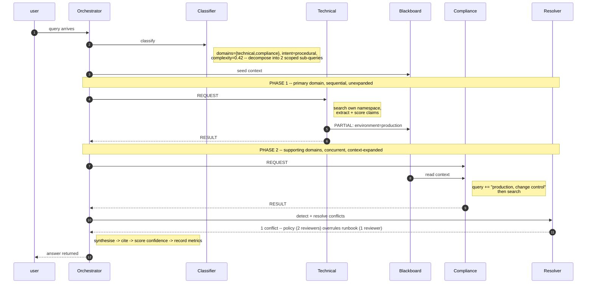

# Architecture

## 1. Overview

The system answers a question by routing it to the knowledge domains that own
parts of the answer, letting each domain's agent retrieve independently,
adjudicating any contradictions between what they found, and synthesising a
single cited answer.

Three domains are modelled, each with its own synthetic corpus and its own
vector-store namespace:

| Domain | Owns | Documents | Passages |
|---|---|---|---|
| `technical` | deployment, APIs, observability, databases, incidents | 17 | 35 |
| `business` | approvals, budget, procurement, governance, prioritisation | 16 | 32 |
| `compliance` | change control, data protection, security, audit, residency | 16 | 34 |

```
                                 user query
                                      v
      +---------------------------------------------------------------+
      |                        RAGOrchestrator                        |
      | plan -> phase 1 -> phase 2 -> resolve -> synthesise -> record |
      +---------------------------------------------------------------+
            |                |                |                 |
            v                v                v                 v
    +---------------+ +------------+ +----------------+ +---------------+
    |QueryClassifier| | MessageBus | |ConflictResolver| |MetricsRegistry|
    |    routing    | |+ Blackboard| |    numeric     | +---------------+
    |    intent     | |typed msgs, | |    polarity    |
    |  complexity   | |transcript, | |  supersession  |
    |   decompose   | |shared facts| +----------------+
    | retr. policy  | +------------+
    +---------------+
                                              |
                                              v
                                    +---------------------+
                                    |     Synthesizer     |
                                    |extractive, or Claude|
                                    +---------------------+
                                               |
                                               v
                                         Answer
                                         - cited text
                                         - conflicts
                                         - confidence
                                         - timings
```

The orchestrator fans out to four components, then synthesises their output
into a cited answer. The domain agents that actually retrieve evidence sit one
level down, fed by the message bus shown above:

```
                        +--------------------+
                        |     MessageBus     |
                        |(from diagram above)|
                        +--------------------+
                |------------------|------------------|
                v                  v                  v
        +---------------+  +--------------+  +----------------+
        |Technical Agent|  |Business Agent|  |Compliance Agent|
        +---------------+  +--------------+  +----------------+
                |                  |                  |
                |                  |                  |
                v                  v                  v
        +-----------+      +-----------+     +-----------+
        |VectorStore|      |VectorStore|     |VectorStore|
        | technical |      | business  |     |compliance |
        |dense+BM25 |      |dense+BM25 |     |dense+BM25 |
        +-----------+      +-----------+     +-----------+

        +-----------------KnowledgeBase------------------+
                 (versioned, incrementally ingestable)
```

## 2. Request lifecycle

Two-phase execution is the central design decision. A flat fan-out would be
simpler, but agents that start simultaneously cannot learn anything from each
other, which reduces "multi-agent" to several independent searches sharing an
output format.



**Why phase 1 runs unexpanded.** Expanding the primary query with context
derived from the query itself was measured and found harmful: terms like
"change record, approval, release" re-derived from the user's own wording pushed
the deployment runbook out of the technical agent's results entirely, replacing
it with secrets-management and database passages. Re-derived terms add no
information while diluting the lexical signal. Only another agent's *discovery*
is new information, so only that earns an expansion.

**What phase 2 gains.** On the deployment question, phase 1 establishes that the
deployment targets production, and the compliance agent appends `production,
change control` to its own query. Measured effect: relevance on `COMP-CHG-002`,
the production change-control policy that governs the answer, rises from 0.521 to
0.642 (+23%), and its supporting passages shift from tangential ones (impact
assessment, lawful basis) to corroborating change-control evidence (audit
evidence, continuous control monitoring).

Being precise about attribution, because two mechanisms are easy to conflate
here: it is *clause anchoring* (§3.1) that gets `COMP-CHG-002` into the result set
at all — without it the stranded clause "compliance checks are needed" misses the
document entirely. Context sharing then sharpens a working result rather than
rescuing a broken one. Both effects are real; neither should be credited with the
other's work.

## 3. Components

### 3.1 Query classifier (`query_classifier.py`)

Answers four questions, each of which changes what happens next.

**Which domains?** Multi-label, not top-1. Every scenario in the assignment spans
two domains, so a single-label classifier would be wrong on all three. Two
independent signals are fused:

- a *learned* TF-IDF centroid per domain, fitted on the indexed passages;
- a *hand-authored* cue lexicon acting as a prior.

They are combined with a **noisy-OR**, not a weighted sum:

```
score = 1 − (1 − cue) · (1 − centroid_ratio · reliability)
```

The two signals have different error profiles — the lexicon is high-precision
and blind to paraphrase, the centroid is high-recall and easily pulled around by
shared corporate vocabulary — so neither should be able to veto the other, which
is exactly what a weighted sum lets the heavier term do. Concretely: under a
weighted sum, "troubleshoot API performance while following our security
policies" ranked *compliance* above *technical*, because the compliance centroid
was highest despite technical matching three strong cues to compliance's two.

**What kind of question?** Six intents (procedural, diagnostic, requirement,
approval, definitional, comparative). Intent changes the dense/lexical balance.

**How complex?** A shallow, explainable blend of clause count, question-word
count, length and domain breadth. A learned regressor would need labelled
difficulty data that does not exist, and would be harder to defend when wrong.

**Should it be split?** Clause splitting is syntactic, so it readily produces
clauses that are not semantically self-sufficient. "…and what compliance checks
are needed?" names nothing retrievable. `anchor_clause` carries the query's
subject back into short clauses; without it, that stub returned generic
audit-evidence passages and missed the governing policy entirely.

### 3.2 Dynamic retrieval policy (`RetrievalPolicy`)

One readable function maps a classification onto per-sub-query parameters, so the
behaviour is auditable rather than scattered as magic numbers:

| Parameter | Driven by | Rationale |
|---|---|---|
| `top_k`, `candidate_pool` | complexity | Compound questions need more evidence; over-retrieving on simple ones adds noise |
| `lexical_weight` | intent | Requirement/approval questions turn on exact tokens ("two reviewers", "30 days", "CAB") |
| `dense_weight` | intent | Diagnostic questions are paraphrase-heavy |
| `mmr_lambda` | domain breadth | Multi-domain questions need cross-document coverage — conflict detection needs two independent sources before it can notice anything |
| `min_score` | routing confidence | Confident routing earns a lower evidence floor; marginal routing pays a higher one |

The chosen parameters are printed per sub-query, so "dynamic" is observable
rather than merely asserted.

### 3.3 Vector store (`vector_store.py`)

**Embeddings are pluggable.** `EmbeddingBackend` is deliberately two methods
(`fit`, `encode`). The default `TfidfSvdBackend` is classical latent semantic
analysis: TF-IDF projected through a truncated SVD. The SVD step makes the
representation distributional, so passages that share no vocabulary still land
close together if they co-occur with the same terms elsewhere.
`SentenceTransformerBackend` implements the same interface for real embeddings.

**Retrieval is hybrid.** Dense cosine handles paraphrase; BM25 handles the rare
exact tokens this corpus is full of (`p99`, `SEV1`, `/healthz`, `DPIA`, `30
days`). The two rankings are fused with **reciprocal rank fusion**, because
cosine similarity and BM25 live on incomparable scales — rank position is the
only common currency. MMR then diversifies, which is not cosmetic: without it a
query returns four passages from the same document, and cross-document coverage
is what gives conflict detection something to compare.

**Two score fields, because ranking and confidence are different jobs.** RRF
scores cluster tightly around `1/k` by construction and are useless for
thresholding, so each result also carries an absolute `relevance` in `[0,1]`
blending cosine with saturated BM25. That is the number abstention thresholds
against.

```
score      = Σ wᵢ / (k + rankᵢ)                     ← ordering
relevance  = 0.6·cosine + 0.4·min(1, bm25/8)        ← confidence, abstention
```

**Namespaces are per-domain.** An agent physically cannot retrieve another
domain's documents, so cross-domain coverage must come from coordination rather
than from a lucky global search.

### 3.4 Agent communication (`protocol.py`)

Two mechanisms, because coordination needs both:

- **`MessageBus`** — point-to-point, ordered, with an append-only transcript keyed
  by `trace_id` and `parent_id` causal links. Every answer is replayable and
  auditable after the fact. Monotonic sequence numbers give a total order that
  wall-clock timestamps cannot guarantee under concurrency.
- **`Blackboard`** — broadcast and additive, scoped per trace. Writes carry
  provenance and confidence. Multiple agents may assert the same key; competing
  assertions are kept rather than overwritten, because discarding one here would
  hide a disagreement that conflict resolution is better placed to adjudicate.

Context assertions are gated on evidence strength (`absolute_floor=0.45`,
`relative_floor=0.80·top`, max 2 passages) and expansions are capped at 4 terms.
Both limits were added after measuring the alternative: unbounded expansion
diluted the compliance agent enough to drop the correct policy from its results.

### 3.5 Conflict resolution (`synthesis.py`)

Three **generic** detectors — none knows anything about this corpus:

| Detector | Fires when | Example found |
|---|---|---|
| `numeric` | same unit family + shared subject anchor + values differ beyond tolerance | 1 reviewer vs 2 reviewers; logs 90 days vs 30 days |
| `polarity` | high token overlap + opposite permission | "enable verbose tracing" vs "verbose tracing must not be enabled" |
| `supersession` | declared version relationship + topical overlap | approval procedure v1.0 superseded by v2.0 |

Every detector is additionally gated on the two claims being *topically* related,
which is what separates a contradiction from a coincidence. Two refinements were
necessary and both came from observed false positives:

1. **Generic anchors.** "Application logs are retained for 90 days" and "customer
   transaction records are retained for seven years" share the anchor `retained`
   and the duration family, but govern different data categories and disagree
   about nothing. When the only shared anchor is a generic measurement predicate,
   the pair must clear a much higher sentence-overlap bar.
2. **Per-dispute deduplication.** A v2 procedure restates most of v1 verbatim.
   Flagging every claim pair across the two versions turned one real
   disagreement into 18 near-identical findings. Candidates are now collapsed per
   `(document pair, kind, dispute)`, keeping the pair with the strongest mutual
   evidence.

Resolution is a weighted score:

```
score = 0.34·authority + 0.26·domain_precedence
      + 0.22·recency   + 0.18·relevance
```

Retrieval relevance is deliberately the *smallest* term: being the best lexical
match for the question has almost nothing to do with being right. Domain
precedence (`compliance 1.00 > business 0.85 > technical 0.70`) encodes an
organisational fact — a compliance policy *defines* the rule, a technical runbook
*describes current practice*, and when practice and policy disagree it is
practice that is out of date. An explicitly superseded document can never win,
whatever it scores.

**The loser is reported, never deleted.** An answer that silently drops the
runbook an engineer has been following is worse than useless: it leaves them
unaware they are non-compliant.

### 3.6 Synthesis and citations

The default `ExtractiveSynthesizer` is deterministic and template-driven. This is
a real trade-off, stated plainly: it costs fluency — the output reads as
structured findings rather than prose. It buys three things that matter more for
this brief:

- every sentence is verbatim from a source document, so it cannot hallucinate;
- output is byte-identical for a given corpus and a given date, so the notebook
  and tests are reproducible (recency decay reads `date.today()`, so confidence
  scores drift slowly over calendar time -- see §5);
- no API key, no network, no model download.

`ClaudeSynthesizer` is the generative counterpart, active only when a credential
is present. It is handed the numbered claims and the *already-resolved* conflicts
and asked to write prose over them — it does not get to re-adjudicate conflicts,
because conflict resolution here is a governance decision with an auditable basis
and should not be delegated to a sampled output. Any API failure falls back to
the extractive path, so enabling it can degrade prose but never lose the answer.

**Selection is by topicality, not by confidence.** Claims carry two scores that
answer different questions, and conflating them produced two real defects:

```
topicality = 0.60·relevance + 0.40·salience      ← about the question?
confidence = 0.36·relevance + 0.26·salience
           + 0.22·authority + 0.16·recency       ← should this be believed?
```

Ranking *displayed* findings by `confidence` let authority and recency outvote
topical fit. Asked "what approvals are needed to deploy a microservice", the
technical agent displayed "Retries use exponential backoff and are capped at three
attempts" (confidence 0.528) above "a production deployment requires one approving
reviewer" (0.449) — identical salience, but the retry guidance sits in a recent
`standard` and the approval rule in an older `runbook`. Authority and recency say
nothing about whether a sentence answers the question, so they now inform
confidence and conflict adjudication only.

Selection then applies a per-domain rule: **each contributing domain shows its
single best finding, plus any others clearing a topicality floor** (absolute 0.40,
or 0.55 × the domain's best, whichever is higher). The first half guarantees a
routed domain is represented; the second stops padding. Citations are minted
*after* selection, which also fixed a source list carrying 15 entries for 8
displayed findings.

**Salience is intent-aware.** A `+0.26` bonus for obligation markers ("must",
"prohibited") biased selection toward policy prose and against procedures — the
wrong way round for a "how do I" question. Asked how to troubleshoot API latency,
"Begin API latency triage by confirming the symptom in the golden-signal
dashboard" scored 0.202, the *lowest* of all candidates, because it contains no
modal verb and no quantity. The bonus now goes to whichever marker class matches
the query intent (procedural markers for diagnostic/procedural intents, obligation
markers for requirement/approval), with a reduced bonus for the other since a
sentence can be both. Salience also blends in query overlap against the document's
title and section, because a query shares few words with any single sentence while
"API Performance Troubleshooting Guide" is decisive evidence.

**Citations are verifiable, not merely rendered.** Each claim carries the
character span of the source document it came from, and `verify_citations`
re-reads every span and reports mismatches. This guards the failure mode that
makes a RAG system worse than no system: a confidently formatted answer whose
citations point at the wrong text, where the citation makes the error look
checked. The test suite corrupts a span deliberately and asserts the verifier
catches it — otherwise "all citations verified" would only prove the verifier
agrees with itself.

### 3.7 Learning mechanism

Feedback moves three bounded, inspectable parameters:

| Parameter | Moved by | Effect |
|---|---|---|
| `routing_weights[domain]` | correction against ground-truth domains | missed domains become more likely to be routed to |
| `agent.trust_weight` | answer rating | scales that agent's claim confidence, feeding conflict resolution |
| `policy.domain_alpha[domain]` | negative ratings | nudges the dense/lexical balance |

All three are clamped (`routing ∈ [0.6, 1.5]`, `trust ∈ [0.7, 1.25]`,
`alpha ∈ [0.6, 1.6]`). Clamping is not incidental: an unbounded update driven by
a handful of signals would happily switch a domain off entirely, silently
excluding it from every future answer. Transparency is chosen over sophistication
deliberately — with this little feedback, a rule that can be reasoned about beats
one that cannot be debugged. State is exported as JSON.

### 3.8 Monitoring

Per-query records capture stage timings, per-agent outcomes, citation and
conflict counts, and routing precision/recall against labels when supplied.
Per-domain aggregation is what identifies a weak domain: frequent abstention
means a corpus coverage gap, high latency means an index problem, never being
routed to means a cue-lexicon problem. The aggregate number hides all three.

## 4. Data model

```
  +----------------------------------+
  |             Document             |
  |doc_id, domain, title, section    |
  |authority, version, effective_date|
  |supersedes, status, tags, text    |
  +----------------------------------+
  +-- authority_weight, effective
                    | 1:N
                    v
  +------------------------+
  |         Chunk          |
  |chunk_id, doc_id, domain|
  |char_start, char_end    |
  |ordinal                 |
  +------------------------+
               | retrieved as
               v
  +---------------+
  |RetrievedChunk |
  |score (RRF)    |
  |relevance [0,1]|
  |dense/lexical  |
  |+ ranks        |
  +---------------+
  +-- describe()
          | extract() -- 1:N
          v
  +------------------------+
  |         Claim          |
  |char span, confidence   |
  |salience, polarity      |
  |measurements, components|
  +------------------------+
               |
  +-------------------+
  v pairs             | kept
  +-------------+     |
  |  Conflict   |     |
  |winner, loser|     |
  |margin, basis|     |
  +-------------+     |
         |            |
         +-----+------+
               v
  +-----------------+
  |     Answer      |
  |confidence, notes|
  |degraded, timings|
  +-----------------+
           |
           v
  +-------------------------+
  |        Citation         |
  |marker, doc_id, char span|
  +-------------------------+
               | verify
               v
          source span (re-read, must match)
```

Claim pairs that contradict become a `Conflict`; the resolved conflict is
reported in the `Answer`, never dropped. Claims that survive (including the
overruled side) are `kept` and feed the `Answer` directly.

Document metadata is not decoration: `authority`, `effective_date`, `version`,
`status` and `supersedes` are all consumed by conflict resolution.

| Authority tier | Weight | Meaning |
|---|---|---|
| `policy` | 1.00 | defines the rule |
| `standard` | 0.85 | how the rule is implemented |
| `runbook` | 0.65 | current practice |
| `wiki` | 0.40 | guidance, possibly stale |

## 5. Trade-offs and what production would change

| Decision | Chosen | Alternative | Why, and what would change at scale |
|---|---|---|---|
| Embeddings | local TF-IDF + SVD | transformer encoder | Reviewer-runnable in seconds with no download. In production, a real encoder behind the same interface, plus a cross-encoder reranker. |
| Vector index | in-memory numpy | pgvector / Qdrant / Pinecone | 101 passages makes a brute-force scan free. Beyond ~10⁵ passages, an ANN index with metadata filtering. |
| Index updates | full namespace refit on ingest | incremental projection | Correct rather than merely convenient: adding a document changes the IDF landscape, and projecting into a stale latent space quietly degrades every comparison. With a pretrained encoder (`requires_refit_on_add = False`) this becomes a true incremental upsert. |
| Synthesis | extractive | generative | Determinism and zero hallucination, and a deterministic core is the regulated-environment default rather than a demo convenience. `ClaudeSynthesizer` is the optional generative layer over the *same* resolved conflicts; before it could be enabled on real data it needs a data-classification gate, prompt-injection handling and an audit log of third-party calls, none of which exist here. |
| Conflict resolution | weighted heuristic | learned ranker | Auditable and explainable, which a governance decision has to be. A learned ranker would need labelled adjudications. |
| Concurrency | two-phase, threads | flat async fan-out | Context sharing requires an ordering. At scale, phase 2 becomes async I/O against a remote store. |
| Classifier | lexicon + centroids | fine-tuned classifier | No labelled routing data exists here, and the hybrid is debuggable per-signal. |

**Known limitations.** Two are worth naming before the generic ones, because they
are capability gaps rather than quality ceilings.

*Weak permission phrasing can misroute.* "Can I enable verbose request tracing in
production to debug latency?" selects technical only: three strong technical cues
(`latency`, `debug`, `tracing`) outweigh the lone `can i` signal, and because the
selection threshold is `top_score × ratio`, an unusually strong primary domain
raises the bar for secondary ones. The result is the failure conflict resolution
exists to prevent — the user learns how to enable verbose tracing and never learns
the security policy forbids it. Explicit permission phrasing routes correctly.
Left unfixed deliberately: raising the cue weight over-routes genuine technical
questions, and capping the relative threshold was measured to fix this single query
at exactly one value (0.42) while improving nothing across twelve independent
harder queries and breaking a different case at 0.40 — a magic number, not an
improvement. Learning per-cue weights from logged feedback is the real fix.

*The supersession detector is inert on the default path.* Superseded documents are
excluded from retrieval so answers quote current policy, which means the detector
receives nothing in normal use. It is reachable with `include_superseded=True` and
through the live knowledge-update flow, both of which are tested. Delivering what
it was built for — "you may be thinking of the old rule, here is what changed" —
requires a second narrow retrieval pass used for conflict detection only, never for
quotation. Not implemented.

Beyond those: claim confidence is a function of `date.today()` through recency
decay, so it drifts slowly over calendar time and "deterministic" carries a date
qualifier; `ClaimExtractor.extract` and `ConflictResolver.detect` both accept an
explicit `now` for a pinned evaluation, but the orchestrator does not thread one
through. Sentence splitting is regex-based and will merge
sentences in messier prose. The cue lexicons are hand-authored and would need
maintenance as domains evolve. Conflict detection is O(n²) in claims, which is
fine at this scale but would need blocking by subject at corpus scale. Numeric
extraction handles the unit families present in this corpus, not arbitrary ones.
Routing thresholds were tuned against a handful of queries, not a held-out set —
with real traffic they should be fitted and monitored for drift.

**Not implemented.** Caching of repeated queries, authentication and per-user
document-level access control, multi-turn conversational context, a held-out
evaluation harness with regression gates, and streaming partial answers.
